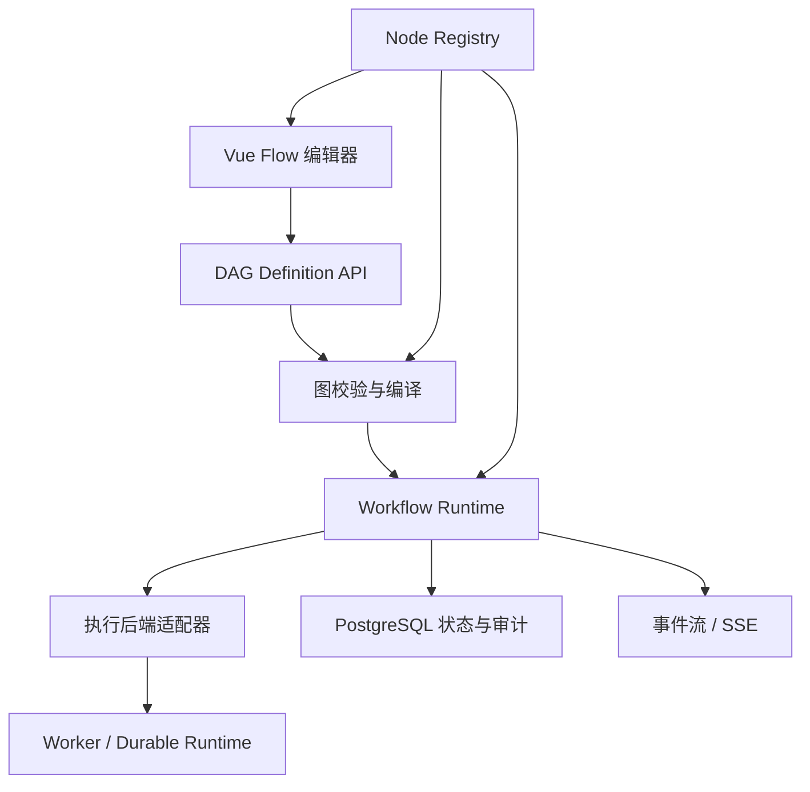

# 后台系统可审计自动化流程引擎开发方案

## 1. 项目定位

本项目面向后台管理系统，提供可视化定义、可审计、可恢复、支持人工审批的自动化流程能力。

第一阶段不建设面向所有行业的低代码平台，而是围绕后台系统操作自动化完成一个真实、可运行的垂直闭环。

目标流程形态：

```text
事件触发
  → 查询数据
  → 条件判断
  → 风险评估
  → 人工审批
  → 执行变更
  → 通知相关人员
  → 记录审计
```

首个验收场景建议为：查询 API Key 状态，判断风险，提交人工审批，批准后吊销 API Key，发送企业微信通知，并写入审计日志。

## 2. 产品边界

### 2.1 第一阶段包含

- Vue Flow 可视化流程编辑器
- 流程草稿、版本和发布
- DAG 节点、边和配置校验
- 条件分支、并行分支和 Join
- 手动触发
- 人工审批和确认
- 节点级状态、错误和日志
- 敏感操作的权限复核和审计
- 基础失败、重试、暂停、恢复和取消能力
- 可插拔 Node Registry

### 2.2 第一阶段不包含

- 大量第三方集成节点
- 任意 JavaScript 或任意 SQL 执行
- 无限循环
- 复杂表达式语言
- 节点市场
- 流程运行中的任意结构修改
- 复制 Dify 的全部模型、知识库和应用发布能力

AI 是可选的节点分组，不是 DAG 内核的中心抽象。

## 3. 总体架构



### 3.1 编辑层

Vue Flow 负责节点拖拽、连线、配置、画布交互和运行状态展示。前端图数据不是执行安全边界，后端必须重新校验和编译。

### 3.2 定义层

后端保存规范化的流程定义和不可变版本：

```ts
type WorkflowDefinition = {
  code: string
  version: number
  status: 'draft' | 'published' | 'archived'
  trigger: TriggerDefinition
  nodes: NodeDefinition[]
  edges: EdgeDefinition[]
  inputSchema?: JsonSchema
}
```

### 3.3 运行层

负责图校验、DAG 编译、依赖解析、分支和 Join、状态管理、重试、超时、暂停、恢复、取消、人工等待和运行事件。

### 3.4 节点层

通过注册表扩展节点，不让调度内核知道具体业务：

```ts
interface NodeExecutor {
  type: string
  version: number

  validate(config: unknown): Promise<void>

  execute(input: {
    runId: string
    nodeRunId: string
    config: unknown
    context: ExecutionContext
    signal: AbortSignal
  }): Promise<{ output: unknown }>
}
```

## 4. 节点分组和 MVP 节点

节点分组可以预先完整规划，具体实现按真实场景逐步增加。

### 4.1 分组

- 触发类：手动、Webhook、定时、事件
- 数据类：查询、转换、过滤、变量、模板
- 控制类：条件、并行、Join、延迟、子流程
- 系统类：HTTP、内部 Service、审计、通知
- 人工类：审批、确认、表单输入、人工复核
- AI 类：分析、知识库查询、Agent、工具调用

### 4.2 第一批实现

```text
manual.trigger
system.query
control.condition
control.parallel
control.join
human.approval
system.service
system.audit
notification.wecom
```

节点必须有稳定的 `type` 和 `version`。节点配置、输入和输出使用 JSON Schema 或 Zod 描述，运行状态不得写回流程定义。

## 5. 前端页面规划

### 5.1 流程列表页

页面类型为 `list`，复用 `ListPage` 和 `DataTable`，支持：

- 搜索和状态筛选
- 新建、复制、发布、归档
- 查看运行记录
- 权限控制和确认对话框

### 5.2 流程编辑页

页面类型为 `workflow`，结构为：

```text
左侧：节点分组面板
中间：Vue Flow 画布
右侧：节点配置面板
顶部：保存、校验、发布、运行
底部：错误和校验信息
```

必须支持草稿自动保存、撤销/重做、节点复制、未保存提示、后端校验错误定位和发布前完整校验。

### 5.3 运行列表页

页面类型为 `list`，展示运行状态、触发方式、发起人、开始时间、耗时、失败节点和当前阻塞节点。

### 5.4 运行详情页

页面类型为 `detail`，展示 DAG 运行图、节点状态、输入输出摘要、日志、重试次数、审批记录、审计事件和失败原因。

## 6. 后端数据模型

建议新增独立的 workflow 领域模型，不复用 AI Agent checkpoint 表作为业务流程真相来源。

### 6.1 流程和版本

```text
workflow_definitions
- id
- code
- name
- description
- status
- current_version
- owner_user_id
- created_at
- updated_at

workflow_versions
- id
- workflow_id
- version
- definition_json
- input_schema_json
- status
- published_by
- published_at
```

### 6.2 运行和节点运行

```text
workflow_runs
- id
- workflow_version_id
- status
- trigger_type
- input_json
- output_json
- error_json
- started_at
- finished_at

workflow_node_runs
- id
- workflow_run_id
- node_id
- node_type
- status
- attempt
- input_json
- output_json
- error_json
- started_at
- finished_at
```

### 6.3 审批和事件

```text
workflow_approvals
- id
- workflow_run_id
- node_run_id
- requested_by_user_id
- approved_by_user_id
- status
- expires_at
- decision_comment

workflow_events
- id
- workflow_run_id
- node_run_id
- event_type
- payload_json
- created_at
```

敏感数据只保存引用或脱敏摘要。密码、API Key、Webhook、恢复码等不得进入普通运行日志、浏览器状态或后续读取接口。

## 7. 权限模型

建议新增并在 `permission_catalog.ts` 中声明：

```text
workflows:read
workflows:create
workflows:update
workflows:publish
workflows:execute
workflows:cancel
workflows:approve
workflows:admin
```

权限必须同时绑定后端路由、前端 route meta、页面操作和节点执行前的服务端授权检查。

敏感节点执行前必须重新校验：

```text
当前用户
+ 当前流程版本
+ 当前节点
+ 当前目标资源
+ 当前资源状态
```

前端可隐藏操作，但不能代替后端授权。

## 8. 执行后端策略

执行层必须通过适配器隔离：

```ts
interface WorkflowExecutionAdapter {
  start(run: WorkflowRunInput): Promise<void>
  pause(runId: string): Promise<void>
  resume(runId: string): Promise<void>
  cancel(runId: string): Promise<void>
}
```

预留三种实现：

```text
InProcessAdapter       本地开发和单元测试
TemporalAdapter        长流程、审批和可靠恢复
ExternalAdapter        未来接入其他执行平台
```

第一阶段可以使用 InProcessAdapter 完成协议和垂直流程验证，但如果流程需要长时间审批、跨进程恢复、第三方调用重试和高并发执行，生产环境必须接入具备 Durable Execution 能力的运行时，或明确降低产品承诺。Temporal 提供工作流恢复、重试、定时器、信号和任务队列等能力，可作为后续适配目标。

## 9. 分阶段开发计划

### 阶段 1：领域模型和节点协议

交付：

- Workflow Definition 类型
- Node Definition 和 Edge Definition
- Node Registry
- 节点输入、配置、输出 Schema
- DAG 环检测和结构校验
- 流程版本模型
- 权限和审计边界

暂不实现大量业务节点和复杂异步调度。

### 阶段 2：Vue Flow 编辑器

交付：

- 节点分组面板
- 画布、连线和端口约束
- 节点配置表单
- 草稿保存
- 发布前校验
- 版本管理
- 运行入口

### 阶段 3：最小执行闭环

实现以下流程：

```text
手动触发
  → 查询 API Key
  → 条件判断
  → 人工审批
  → 吊销 API Key
  → 企业微信通知
  → 审计记录
```

交付节点状态、运行详情、错误显示、基础重试、取消和审批恢复。

### 阶段 4：生产级执行

交付：

- Durable Execution 适配器
- 长时间暂停和恢复
- Worker 执行
- 并发和限流
- 幂等键
- 超时回收
- 节点级重试
- 事件流和监控指标
- 失败告警

### 阶段 5：业务节点扩展

优先加入：

- 企业微信
- 用户和角色管理
- API Key 管理
- AI 分析
- 知识库查询
- Webhook
- 定时触发
- 子流程

## 10. MVP 验收标准

- 后端拒绝存在环的流程
- 未发布版本不能执行
- 已发布版本不可直接修改
- 运行记录绑定到明确的流程版本
- 每个节点有独立状态和错误信息
- 节点失败不会丢失流程运行记录
- 敏感节点执行前重新鉴权
- 审批状态不能被前端伪造
- 重试不会重复执行已成功节点
- 敏感操作生成审计事件
- 前端覆盖 loading、empty、error、disabled 和 unauthorized 状态
- 运行详情能够定位失败节点、审批节点和错误原因

## 11. 开发原则

1. Vue Flow 是编辑器，不是执行引擎。
2. PostgreSQL 中的标准化流程版本是事实来源。
3. Node Registry 是扩展核心。
4. AI 是节点类型，不是 DAG 内核。
5. 流程定义、流程运行和节点运行必须分离。
6. 所有敏感节点都必须服务端授权并审计。
7. 节点执行必须考虑幂等性、超时和重试。
8. 先完成一个真实业务流程，再扩大通用能力。
9. 不允许为了通用性提前实现大量节点。
10. 后续新增 API、权限、迁移、页面或节点时，必须同步更新 OpenAPI、类型、权限迁移和测试。
