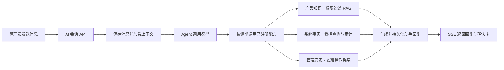
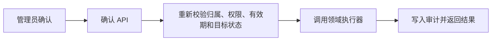

# API Starter Kit

> 面向 AI 管理应用的全栈项目模板，内置安全、权限、可观测性与受控 AI 能力。

[](LICENSE)
[](package.json)
[](package.json)

API Starter Kit 提供身份认证、细粒度权限、审计、API 契约、知识库与受控 AI 工具等基础能力，帮助团队构建可运营、可扩展、可审计的业务系统。

## 核心特性

### 安全与治理基础能力

项目内置认证、双因素认证、RBAC、API Key、敏感凭据一次性展示、后端权限复核与审计日志等能力，为业务模块提供统一的安全与治理基础。

### 受控 AI 能力

AI 可基于权限检索知识、读取实时系统信息、通过预制模板查询数据，并为敏感管理操作创建待确认提议。模型不执行自由 SQL；聊天文本不构成授权；所有查询与操作均受服务端权限、校验与脱敏策略约束。

### 工程化开发基础

前后端分层、统一组件、页面模板、OpenAPI、Docker、Monorepo、类型检查与格式化规范构成一致的开发基础，支持在既有架构内持续扩展业务能力。

### 统一的管理与 AI 工作台能力

用户、角色、权限、API Key、知识库、审计记录、AI 会话与受控工具共享统一的权限边界和治理模型。

## 模板能力

### 已包含的能力

- **用户认证** — 登录/登出、密码强度与过期策略、登录锁定
- **双因素认证** — TOTP 2FA (基于 otplib + QR 码)
- **API Key 管理** — 创建/吊销/删除，支持过期时间配置
- **OpenAPI 文档** — Scalar UI 与 JSON/YAML 规范，自动由路由和装饰器生成
- **路由驱动导航** — 侧栏菜单与面包屑均来自路由 `meta` 定义
- **Schema 构建器** — JSON Schema 的可视化编辑、校验与预览示例
- **模板中心** — 概览、详情、设置、列表管理、任务流转、数据分析、分步引导与操作模式示例
- **受控 AI 助手** — OpenAI 兼容、流式多轮对话、知识库 RAG、受控管理操作与注册模板查询
- **国际化** — 中文和英文文案
- **Docker 部署** — 多阶段构建，Nginx + 支持 pgvector 的 PostgreSQL 15
- **Monorepo 工程** — pnpm workspace + Turborepo + ESLint + Prettier

### 产品能力总览

| 模块             | 当前可用能力                                                                     |
| ---------------- | -------------------------------------------------------------------------------- |
| 账号与安全       | 管理员初始化、登录/登出、密码强度与修改、登录失败锁定、TOTP 双因素认证与恢复码   |
| 用户、角色与权限 | 用户管理、角色管理、权限目录、基于 Bouncer 的后端鉴权、前端权限显隐              |
| API Key          | 创建、更新、吊销、删除、过期时间、哈希校验与仅一次明文展示                       |
| 审计日志         | 关键系统管理动作与 AI 受控操作确认的审计记录、筛选查询                           |
| 知识库           | 审查后上传/编辑/发布文档、权限过滤、向量检索与结构化检索元数据                   |
| AI 工作台        | 基于检索的产品问答、实时系统信息、注册模板查询、受控管理操作、会话历史与耗时追踪 |
| 页面模板         | 管理列表、详情、设置、任务流转、数据分析、分步引导和操作模式示例                 |

## 文档目录

- [核心特性](#核心特性)
- [模板能力](#模板能力)
  - [已包含的能力](#已包含的能力)
  - [产品能力总览](#产品能力总览)
- [使用与开发](#使用与开发)
  - [快速开始](#快速开始)
  - [开发命令](#开发命令)
  - [API 概览](#api-概览)
  - [页面与模板](#页面与模板)
  - [AI 助手](#ai-助手)
  - [部署](#部署)
  - [安全设计](#安全设计)
  - [项目结构](#项目结构)
  - [环境配置](#环境配置)
  - [技术栈](#技术栈)

## 使用与开发

### 快速开始

#### 环境要求

- Node.js `>= 24.12.0`
- pnpm `11.9.0`
- Docker Desktop（本地 PostgreSQL）或可访问的 PostgreSQL 15+ 实例

#### 1. 安装依赖

```bash
pnpm install
```

#### 2. 创建环境变量文件

```bash
cp apps/backend/.env.example apps/backend/.env
cp apps/frontend/.env.example apps/frontend/.env
```

生成后端 `APP_KEY`：

```bash
pnpm --dir apps/backend exec node ace generate:key --show
```

写入 `apps/backend/.env`：

```env
APP_KEY=<generated-app-key>
```

#### 3. 启动本地服务

```bash
pnpm docker:up
```

该命令只启动并等待 `postgres` 服务就绪；开发服务器仍需在后续步骤通过 `pnpm dev` 启动。若使用已有的 PostgreSQL 实例，可跳过此步骤，并将 `apps/backend/.env` 的 `DB_*` 变量改为目标数据库的连接信息。

AI 助手默认配置指向本机 Ollama 的 OpenAI 兼容地址。Ollama 不会随默认 Compose 启动，也不会自动拉取模型。需要本地模型时，按需启动并手动拉取：

```bash
docker compose --profile ollama up -d ollama
docker compose exec ollama ollama pull llama3.2:1b
```

`llama3.2:1b` 适合基础对话和本地开发。也可以在 `apps/backend/.env` 按用户配置覆盖 `AI_OPENAI_*` 变量，接入宿主机 Ollama、独立 Ollama 服务或任意 OpenAI 兼容服务。

当后端也运行在 Docker Compose 中并使用该可选 Ollama 服务时，将 `apps/backend/.env` 中的地址改为 Docker 服务名：

```env
AI_OPENAI_BASE_URL=http://ollama:11434/v1
```

#### 4. 执行数据库迁移

```bash
pnpm --dir apps/backend exec node ace migration:run
```

#### 5. 启动开发服务

```bash
pnpm dev
```

默认访问地址：

| 服务       | 地址                                        |
| ---------- | ------------------------------------------- |
| 前端       | `http://localhost:18080`                    |
| 后端 API   | `http://localhost:13333`                    |
| PostgreSQL | `localhost:5432`                            |
| Ollama     | `http://localhost:11434`（启用 profile 后） |

开发环境不经过 Nginx。OpenAPI 文档由后端直接提供，需在后端 `.env` 中设置 `OPENAPI_DOCS_ENABLED=true` 启用：`http://localhost:13333/api-docs`。

默认管理员来自 `apps/backend/.env`：

```env
ADMIN_EMAIL=admin@example.local
ADMIN_PASSWORD=Change-Me-1234-5678-9012
ADMIN_FULL_NAME=Admin
```

只有当用户表为空时，系统才会自动创建管理员。

### 开发命令

常用命令：

```bash
pnpm install          # 安装依赖
pnpm dev              # 启动前后端开发服务
pnpm build            # 构建全部应用
pnpm typecheck        # 类型检查
pnpm test             # 测试
pnpm format           # 格式化
```

后端：

```bash
pnpm --dir apps/backend dev
pnpm --dir apps/backend typecheck
pnpm --dir apps/backend test
pnpm --dir apps/backend exec node ace migration:run
pnpm --dir apps/backend exec node ace migration:fresh --force
```

前端：

```bash
pnpm --dir apps/frontend dev
pnpm --dir apps/frontend typecheck
pnpm --dir apps/frontend test
pnpm --dir apps/frontend build
```

### API 概览

后端已接入 `@foadonis/openapi`，OpenAPI 文档由 AdonisJS 路由和装饰器生成。

| 入口      | 地址             | 说明               |
| --------- | ---------------- | ------------------ |
| 文档页面  | `/api-docs`      | Scalar UI 文档界面 |
| JSON 规范 | `/api-docs.json` | OpenAPI JSON       |
| YAML 规范 | `/api-docs.yaml` | OpenAPI YAML       |

文档路由由后端环境变量 `OPENAPI_DOCS_ENABLED=true` 控制，默认仅在开发环境启用。前端通过 `VITE_API_DOCS_URL` 配置文档链接（留空则隐藏入口），开发环境默认指向 `http://localhost:13333/api-docs`。

业务 API 基础路径：`/api/v1`。下表路径均相对于该基础路径；OpenAPI 文档不在此前缀下。

健康检查：

| 方法  | 路径            | 说明                                     |
| ----- | --------------- | ---------------------------------------- |
| `GET` | `/health`       | 存活检查（轻量，始终返回 ok）            |
| `GET` | `/health/ready` | 就绪检查（含数据库连通性和 AI 配置状态） |

认证与账号：

| 方法   | 路径                    | 说明                         |
| ------ | ----------------------- | ---------------------------- |
| `POST` | `/auth/login`           | 登录                         |
| `GET`  | `/auth/github`          | 发起 GitHub 授权登录         |
| `GET`  | `/auth/github/callback` | GitHub OAuth 回调            |
| `POST` | `/auth/github/exchange` | 兑换一次性 GitHub 登录凭据   |
| `POST` | `/auth/2fa/verify`      | 登录时验证 2FA               |
| `POST` | `/auth/signup`          | 已禁用，管理员由环境变量创建 |
| `GET`  | `/account/profile`      | 当前管理员信息               |
| `PUT`  | `/account/password`     | 修改密码                     |
| `POST` | `/account/2fa/generate` | 生成 2FA 配置                |
| `POST` | `/account/2fa/enable`   | 启用 2FA                     |
| `POST` | `/account/2fa/disable`  | 停用 2FA                     |
| `POST` | `/account/logout`       | 退出登录                     |

管理接口：

| 资源    | 路径                         |
| ------- | ---------------------------- |
| API Key | `/api-keys`、`/api-keys/:id` |

系统管理接口位于 `/system`：用户（`/users`）、角色（`/roles` 和 `/roles/catalog`）、权限（`/permissions` 和 `/permissions/catalog`）、审计日志（`/audit-logs`）与知识文档（`/knowledge-documents`）。AI 会话接口位于 `/ai-chat/conversations`，消息发送和受控操作确认均嵌套在对应会话资源下。具体请求、响应与权限要求以已启用的 OpenAPI 文档为准。

模板提供 API Key 的生成、校验与中间件能力，但当前没有内置业务接口启用 API Key 鉴权。接入新业务接口时，显式挂载 `middleware.apiKey()` 后才可使用 API Key；账户、登录、2FA、API Key 管理与 AI 会话接口使用管理员 Bearer Token，不接受 API Key。

除健康检查和 SSE 流式消息外，业务接口使用以下成功响应封装；分页列表的 `data` 中还包含 `items` 和 `meta`：

```json
{
  "data": {}
}
```

### 页面与模板

前端导航、面包屑和模板入口由 `apps/frontend/src/router/modules/workbench.ts` 的路由元信息驱动。侧栏的“模板”分组包含以下可运行示例：

- 页面模板：概览、详情、设置、组合筛选、批量操作、侧栏详情和移动端列表
- 任务流转：审批状态、评论和活动时间线
- 数据分析：筛选、指标、骨架加载、表格与分页
- 分步引导：表单校验与 `Stepper` 进度
- 操作模式：高级表单、搜索选择、导入导出、命令面板、通知与反馈状态

这些页面使用当前项目的设计 token 和 shadcn-vue 组件，作为后续业务页面的实现参考，而非生产数据看板。

### AI 助手

AI 助手通过 OpenAI 兼容接口接入 OpenAI、DeepSeek、Qwen 和 Ollama 等服务，提供流式输出、多轮上下文和会话历史。原始消息始终保留在应用数据库中，并在达到消息数或 token 阈值时压缩模型工作上下文。知识库回答会随助手消息保存结构化检索元数据，但不在聊天界面展示来源；受控操作确认卡会展示安全的变更摘要，而 API Key 或临时密码仅在确认成功后一次性展示，并提供复制操作。

#### 处理流程



受控操作只有在管理员点击确认卡后才会执行：



#### 当前可用能力与边界

| 类别           | 当前能力                                                                                                                               | 边界                                                                                             |
| -------------- | -------------------------------------------------------------------------------------------------------------------------------------- | ------------------------------------------------------------------------------------------------ |
| 产品与流程问答 | 对部署、配置、功能和流程类问题先检索已发布知识文档，再基于检索结果回答；结构化检索元数据随消息保存但不在聊天界面展示                   | 不把通用模型知识或历史会话中的旧说法当作系统事实；未发布或无权限的文档不会参与检索               |
| 当前系统信息   | 查询当前账号权限，以及非敏感的 API Key、用户、角色、权限和审计日志信息                                                                 | 每次工具调用重新执行后端权限校验；不会返回密码、API Key 明文、2FA 密钥或其他凭据                 |
| 受控数据查询   | 通过已注册模板查询管理用户、角色、权限与审计事件；支持缺参追问、跨轮补参、结果行数上限和字段脱敏                                       | 模型不能生成 SQL、表名、字段或任意参数；每次执行都会校验模板权限，原始敏感数据不进入模型上下文   |
| 受控管理操作   | 创建 API Key、吊销 API Key、重置密码、启用/停用/更新/删除用户，以及创建/更新/删除角色或权限                                            | 助手只能创建有时效的操作提议；必须通过结构化确认卡确认，执行前会再次校验会话归属、权限和目标状态 |
| 会话与可观测性 | 完整保存用户和助手消息、来源文档与待确认操作；长会话使用持久化摘要缩减模型上下文；每轮记录首个 Agent 事件、工具与首个回复 token 的耗时 | 上下文缩减只影响发送给模型的内容，不会删除历史消息；模型或上游连接中断时仍保留已生成的助手内容   |

助手只处理上述有后端工具支撑的系统问题。模型文本、Markdown、浏览器页面数据和历史消息都不是授权或执行指令；它们不能直接触发业务变更。

#### Langfuse Cloud 调用追踪

可选接入 Langfuse Cloud 追踪模型调用、Agent、检索和工具执行。创建 Langfuse 项目后，将项目密钥写入 `apps/backend/.env` 并重启后端：

```env
LANGFUSE_ENABLED=true
LANGFUSE_PUBLIC_KEY=pk-lf-...
LANGFUSE_SECRET_KEY=sk-lf-...
LANGFUSE_BASE_URL=https://us.cloud.langfuse.com
```

每条 trace 都带有会话、用户和 `agentRunId` 元数据。未配置或设为 `false` 时不会初始化 Langfuse，也不会产生外部网络调用。敏感令牌会在导出前脱敏；本地仅保留既有会话、确认记录和审计日志，不重复存储完整模型调用内容。

#### 知识库检索（RAG）

迁移会启用 PostgreSQL 的 `vector` 扩展，并创建独立的知识文档、分块及文档角色关联表。知识库不会自动收集用户、审计日志、会话消息或任何凭据；只有经审查后通过系统管理菜单上传的 UTF-8 文本文档（TXT、Markdown、reStructuredText，最大 2MB）才会发送到 embedding 服务。系统按句子和段落生成语义向量，依据相邻内容的语义差异切分，再使用最大字符数与重叠作为保护；因此上传、替换或“重建索引”都会产生句子级和最终分块两轮 embedding 请求。文档上传后默认禁用，向量化完成后才能启用。单一 Agent 仅在选择 `search_knowledge` 工具后执行向量检索；普通问答、系统信息查询和受控操作在进入 Agent 前不会发送 embedding 请求。若已发布文档没有分块，可使用“重建索引”从其已保存内容恢复索引。系统管理菜单中的“知识文档”页面要求 `knowledge:manage`，检索要求 `knowledge:read`；检索结果被视为不可信参考资料，不能触发操作或绕过现有确认机制。

向量列固定为 1024 维，因此部署前需选择兼容的 embedding 模型，例如 Qwen3-Embedding-0.6B-4bit-DWQ，并单独配置：

后端配置位于 `apps/backend/.env`：

| 变量                                          | 说明                                                                 |
| --------------------------------------------- | -------------------------------------------------------------------- |
| `AI_OPENAI_API_KEY`                           | 服务商 API Key，Ollama 默认值为 `ollama`                             |
| `AI_OPENAI_BASE_URL`                          | OpenAI 兼容 API 地址，默认本地 Ollama                                |
| `AI_OPENAI_MODEL`                             | 模型名称，默认 `llama3.2:1b`                                         |
| `AI_EMBEDDING_API_KEY`                        | 可选，embedding 服务 API Key；未设置时回退到 `AI_OPENAI_API_KEY`     |
| `AI_EMBEDDING_BASE_URL`                       | 可选，embedding 服务地址；未设置时回退到 `AI_OPENAI_BASE_URL`        |
| `AI_EMBEDDING_MODEL`                          | 必填，兼容 1024 维输出的 embedding 模型                              |
| `AI_EMBEDDING_DIMENSIONS`                     | embedding 输出维度，当前必须为 `1024`                                |
| `KNOWLEDGE_CHUNK_MAX_CHARACTERS`              | 语义分块的最大字符数，默认 `1800`                                    |
| `KNOWLEDGE_CHUNK_OVERLAP_CHARACTERS`          | 相邻分块保留的字符数，默认 `200`                                     |
| `KNOWLEDGE_SEMANTIC_BREAKPOINT_PERCENTILE`    | 语义切点阈值百分位，默认 `90`，范围 `50-100`                         |
| `AI_SYSTEM_PROMPT`                            | 可选的项目系统提示词                                                 |
| `AI_TEMPERATURE`                              | 生成温度，服务端限制为 `0-2`；Qwen 未配置时默认 `0.1`                |
| `AI_MAX_HISTORY_MESSAGES`                     | 上下文摘要后保留最近消息数的上限，范围 `1-100`                       |
| `LANGFUSE_ENABLED`                            | 是否启用 Langfuse Cloud 追踪，默认 `false`                           |
| `LANGFUSE_PUBLIC_KEY` / `LANGFUSE_SECRET_KEY` | Langfuse Cloud 项目公钥和私钥                                        |
| `LANGFUSE_BASE_URL`                           | Langfuse Cloud 地址，示例默认 `https://us.cloud.langfuse.com`        |
| `AI_CONTEXT_COMPRESSION_ENABLED`              | 是否启用上下文自动压缩，默认 `true`                                  |
| `AI_CONTEXT_COMPRESSION_THRESHOLD_TOKENS`     | 触发上下文摘要的 token 阈值，默认 `6000`，范围 `1024-1000000`        |
| `AI_CONTEXT_COMPRESSION_RECENT_MESSAGES`      | 摘要后仍保留的最近消息数，默认 `8`，范围 `1-AI_MAX_HISTORY_MESSAGES` |
| `AI_REQUEST_TIMEOUT_MS`                       | 单次 AI 请求超时，默认 `60000` ms，范围 `5000-300000`                |
| `AI_MAX_RETRIES`                              | 瞬时失败重试次数，默认 `2`，范围 `0-5`                               |

业务能力必须先在后端 Agent capability registry 中注册，并通过既有 service、Vine validator、Bouncer 权限与审计机制执行。当前只读工具包括 `diagnose_my_access`、`list_api_keys`、`list_roles`、`list_permissions`、`run_registered_query` 和 `search_knowledge`。其中 `run_registered_query` 只能调用服务端注册的模板；模板定义参数、权限、结果字段、行数上限和脱敏策略，并可在缺少必填参数时持久化待处理状态，等待下一轮补齐。受控操作包含 API Key 创建/吊销、用户密码重置及用户、角色、权限的创建、更新、启用/停用或删除。每个提议记录动作、目标摘要、请求人、会话、状态和有效期；实际执行通过统一确认入口再次校验会话归属、当前权限、目标状态与有效期，并写入 `agent.action_confirmed` 审计事件。前端在输入框上方使用非阻塞的助手内批准提示，不使用弹窗或 Markdown 按钮；取消仅收起提示并保留提议，之后的明确批准回复仍可确认该同一提议。模型文本与 Markdown 不能触发执行。

助手请求仅发送当前路由与页面标题；权限、系统事实和知识内容始终由后端工具实时校验与读取。

针对单机部署模型，可执行 `pnpm --dir apps/backend exec node ace ai:evaluate`。该命令使用当前 `AI_OPENAI_*` 配置和 mock 工具，在不连接业务数据库、不创建提案、不执行变更的前提下，验证知识检索、实时系统事实、角色权限、注册查询、缺参追问、受控变更、权限拒绝与自由 SQL 拒绝等场景。每个场景都要求调用精确的工具集合，并验证回复是否通过已有的事实依据/范围保护策略；任一失败即返回非零退出码，适合作为模型、量化或提示词变更的回归门禁。Qwen3-4B-Instruct-2507-4bit 建议保持低温度（默认 `0.1`）。

### 部署

构建并启动生产 Docker 服务：

```bash
docker compose build
docker compose up -d
```

生产 Compose 行为：

- 启动支持 pgvector 的 PostgreSQL 15（向量表迁移需启用 `vector` 扩展）
- 不强制启动 Ollama；启用 `ollama` profile 后由用户自行拉取模型
- 后端启动前自动执行数据库迁移
- 前端由 Nginx 提供静态资源
- Nginx 将 `/api/*` 代理到后端
- OpenAPI 文档由后端 `13333` 端口直接提供；生产环境需要时设置 `OPENAPI_DOCS_ENABLED=true`，并按部署网络策略暴露或反向代理该端口
- 后端运行端口读取 `apps/backend/.env` 的 `PORT`

默认生产地址：

| 服务 | 地址                     |
| ---- | ------------------------ |
| 前端 | `http://localhost:18080` |
| 后端 | `http://localhost:13333` |

### 安全设计

- 注册接口禁用；仅在用户表为空时由环境变量初始化首个管理员
- 系统支持通过用户、角色与权限模块维护多个管理账号；`super-admin` 是受保护的 bootstrap 角色，不能通过管理界面或 API 分配或变更其成员关系
- 用户表非空时不会重复创建管理员
- 密码由框架 Hash 能力存储
- 密码策略要求长度和字符混合，并拦截常见弱密码
- 连续登录失败会触发账号锁定
- 2FA secret 和 recovery code 加密存储
- API Key 使用 hash 鉴权，完整明文仅在创建时返回一次，不存储可逆密文
- 生产错误响应脱敏，不暴露 SQL、堆栈和内部异常细节
- **限流** — 登录/2FA 端点按 IP 限流（10 次/分钟），账户操作和 AI 对话按用户限流
- **CSP** — 后端 Shield 中间件和 Nginx 均设置 Content-Security-Policy，`default-src 'self'`，`object-src 'none'`，SPA 与 API 响应均受保护
- **AI 超时与重试** — AI 模型调用配置 `AI_REQUEST_TIMEOUT_MS`（默认 60s）和 `AI_MAX_RETRIES`（默认 2）；该超时同时限制完整流式会话，防止上游卡住时请求无限等待
- **AI 输出 XSS 防护** — 前端 Markdown 渲染器 `html-policy="escape"`，完全转义 raw HTML
- **容器非 root** — Docker 后端镜像以 `node` 用户运行
- **Nginx 安全头** — `X-Content-Type-Options`、`X-Frame-Options: DENY`、`Referrer-Policy`、`Content-Security-Policy`

### 项目结构

```text
.
├── apps/
│   ├── backend/
│   │   ├── app/controllers/          # HTTP 控制器
│   │   ├── app/middleware/           # 认证、API Key、JSON 响应中间件
│   │   ├── app/models/               # Lucid 模型
│   │   ├── app/services/             # 业务服务
│   │   ├── app/validators/           # VineJS 校验器
│   │   ├── database/migrations/      # 数据库迁移
│   │   └── start/                    # 路由与启动配置
│   └── frontend/
│       ├── src/components/           # 业务组件和 shadcn-vue 组件
│       ├── src/lib/                  # API、表单构建、工具函数
│       ├── src/locales/              # 中文和英文文案
│       ├── src/router/               # 路由模块
│       ├── src/stores/               # Pinia store
│       └── src/views/                # 页面
├── docker-compose.yml
├── Dockerfile
├── package.json
├── pnpm-workspace.yaml
└── turbo.json
```

### 环境配置

#### 后端

文件：`apps/backend/.env`

| 变量                                          | 说明                                           |
| --------------------------------------------- | ---------------------------------------------- |
| `NODE_ENV`                                    | 运行环境：`development`、`production`、`test`  |
| `HOST` / `PORT`                               | 后端监听地址                                   |
| `LOG_LEVEL`                                   | 日志级别                                       |
| `APP_KEY`                                     | AdonisJS 应用密钥                              |
| `APP_URL`                                     | 后端对外地址                                   |
| `ADMIN_EMAIL`                                 | 默认管理员邮箱                                 |
| `ADMIN_PASSWORD`                              | 默认管理员密码                                 |
| `ADMIN_FULL_NAME`                             | 默认管理员名称                                 |
| `SESSION_DRIVER`                              | Session 驱动                                   |
| `DB_HOST` / `DB_PORT`                         | PostgreSQL 地址                                |
| `DB_USER` / `DB_PASSWORD` / `DB_DATABASE`     | PostgreSQL 凭据                                |
| `CORS_ORIGIN`                                 | 允许访问 API 的前端源，逗号分隔                |
| `OPENAPI_DOCS_ENABLED`                        | 是否注册 `/api-docs` 及 OpenAPI 规范入口       |
| `TZ`                                          | 运行时区，建议 `Asia/Shanghai`                 |
| `AI_OPENAI_API_KEY`                           | OpenAI 兼容服务的 API Key，默认 `ollama`       |
| `AI_OPENAI_BASE_URL`                          | OpenAI 兼容服务地址，默认本地 Ollama           |
| `AI_OPENAI_MODEL`                             | 模型名称，默认 `llama3.2:1b`                   |
| `AI_EMBEDDING_API_KEY`                        | 可选；未设置时使用 `AI_OPENAI_API_KEY`         |
| `AI_EMBEDDING_BASE_URL`                       | 可选；未设置时使用 `AI_OPENAI_BASE_URL`        |
| `AI_EMBEDDING_MODEL`                          | 知识库 embedding 模型，需输出 1024 维向量      |
| `AI_EMBEDDING_DIMENSIONS`                     | embedding 输出维度，当前必须为 `1024`          |
| `KNOWLEDGE_CHUNK_*`                           | 知识库分块长度、重叠与语义切点参数             |
| `AI_SYSTEM_PROMPT`                            | 可选的 AI 系统提示词                           |
| `AI_TEMPERATURE`                              | AI 生成温度，范围 `0-2`                        |
| `AI_MAX_HISTORY_MESSAGES`                     | 上下文摘要后保留最近消息数的上限，范围 `1-100` |
| `AI_CONTEXT_COMPRESSION_ENABLED`              | 是否启用 AI 上下文自动压缩，默认 `true`        |
| `AI_CONTEXT_COMPRESSION_THRESHOLD_TOKENS`     | 触发上下文摘要的 token 阈值，默认 `6000`       |
| `AI_CONTEXT_COMPRESSION_RECENT_MESSAGES`      | 摘要后保留的最近消息数，默认 `8`               |
| `AI_REQUEST_TIMEOUT_MS`                       | 单次 AI 请求超时，范围 `5000-300000` ms        |
| `AI_MAX_RETRIES`                              | 瞬时失败重试次数，范围 `0-5`                   |
| `LANGFUSE_ENABLED`                            | 是否启用 Langfuse；必须同时配置公钥和私钥      |
| `LANGFUSE_PUBLIC_KEY` / `LANGFUSE_SECRET_KEY` | Langfuse 项目密钥                              |
| `LANGFUSE_BASE_URL`                           | Langfuse 服务地址，示例为美国区 Cloud 地址     |

#### 前端

文件：`apps/frontend/.env`

| 变量                        | 说明                                                   |
| --------------------------- | ------------------------------------------------------ |
| `VITE_API_URL`              | 开发环境后端 API 地址                                  |
| `VITE_API_DOCS_URL`         | OpenAPI 文档链接；留空则隐藏导航入口                   |
| `VITE_DEV_API_PROXY_TARGET` | Vite 开发代理的后端地址，默认 `http://localhost:13333` |
| `TZ`                        | 运行时区                                               |

### 技术栈

后端：

- AdonisJS 7
- Lucid ORM
- PostgreSQL
- VineJS
- OpenAPI / Scalar UI
- Japa (测试)
- Luxon
- otplib + qrcode (2FA)

前端：

- Vue 3 (Composition API + `<script setup>`)
- Vue Router 5
- Pinia 3
- shadcn-vue / Reka UI
- Tailwind CSS 4
- vee-validate + Zod
- TanStack Table
- vue-sonner
- vue-i18n
- markstream-vue

工程：

- pnpm workspace
- Turborepo
- Docker
- ESLint + Prettier

### License

[MIT](LICENSE)
