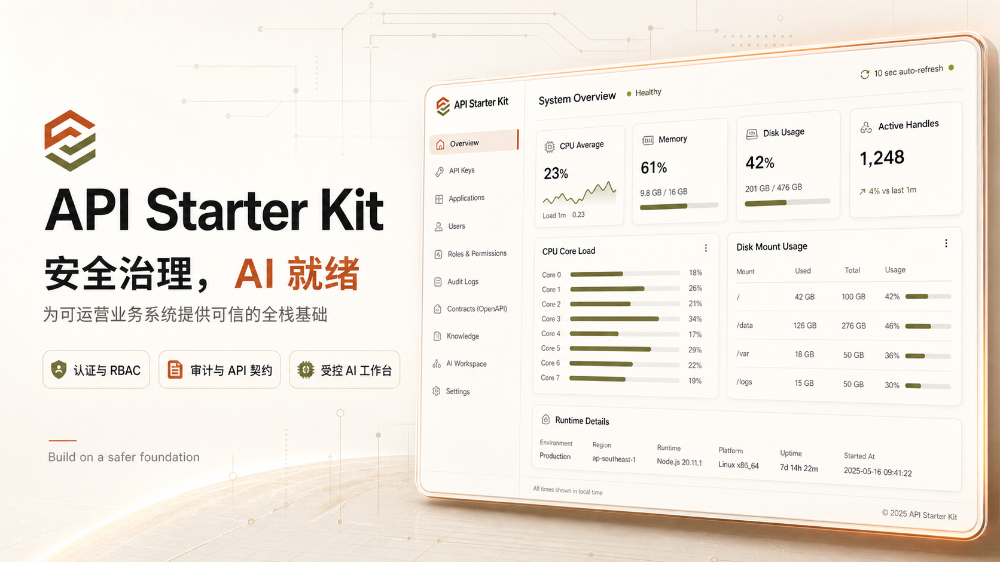

# API Starter Kit

> 面向 AI 管理应用的全栈模板，内置安全、治理、可观测性与受控 AI 能力。

API Starter Kit 为团队构建可运营业务系统提供统一的治理基础。认证、细粒度权限、审计记录、API 契约、知识检索与 AI 辅助管理共享同一安全模型，业务功能可以在此基础上持续扩展。

## 项目定位

这是一个 pnpm/Turborepo 全栈 monorepo：后端使用 AdonisJS 7，前端使用 Vue 3。仓库提供系统级能力，不预设具体业务领域，适合从产品需求出发构建新的管理应用。

## 核心能力

| 领域             | 能力                                                                                  |
| ---------------- | ------------------------------------------------------------------------------------- |
| 账号与安全       | 管理员初始化、登录、密码策略、账号锁定、TOTP 2FA、恢复码和 GitHub OAuth               |
| 用户、角色与权限 | RBAC、权限目录、Bouncer 鉴权、路由驱动导航和前端权限显隐                              |
| API Key          | 创建、更新、吊销、删除、过期管理、哈希校验和仅一次明文展示                            |
| 审计与可观测性   | 关键管理操作与已确认 AI 操作的可检索审计记录                                          |
| 知识库           | 审查后的文档管理、角色访问控制、向量检索和结构化检索元数据                            |
| AI 工作台        | Pi Agent 流式对话、完整历史、知识问答、注册查询和需确认的管理操作提议                 |
| 外部 AI 渠道     | 企业微信、飞书、钉钉智能机器人长连接、私聊身份绑定，以及群聊公开知识库访客问答        |
| 交付基础         | OpenAPI/Scalar、Docker（配置位于 `docker/`）、pgvector PostgreSQL、国际化与自动化检查 |

AI 助手只能访问授权的知识和注册查询模板；管理类操作只创建持久化提议，必须经过结构化确认后执行。后端负责校验、授权、脱敏、持久化和审计，前端不是安全边界。

系统管理中的「LLM 配置」仅维护 Chat、ASR、Embedding 和请求超时；「IM 配置」单独维护企业微信、飞书和钉钉机器人凭据及卡片模板。

## 从这里开始

1. [快速开始](docs/getting-started.md)：安装依赖并启动本地环境。
2. [开发指南](docs/customization.md)：新增业务 feature、页面、API 和权限。
3. [系统架构](docs/architecture.md)：理解前后端边界和扩展位置。
4. [文档总览](docs/README.md)：按场景查找 API、安全、部署和 AI 参考。

## 依赖升级检查

GitHub Dependabot 会每周一检查 pnpm workspace 和 GitHub Actions 的版本，并按生产依赖、开发依赖和 Actions 分组创建升级 PR。升级 PR 会经过仓库现有 CI 验证后再合并；Dependabot 不会直接修改默认分支。

## 安全防护

仓库管理员需要在 GitHub 的 **Settings → Advanced Security → Secret Protection** 中开启 Secret Scanning 和 Push Protection。它们是 GitHub 仓库级安全设置，不能通过提交代码文件代替开启。

## 许可证

[MIT](LICENSE)
