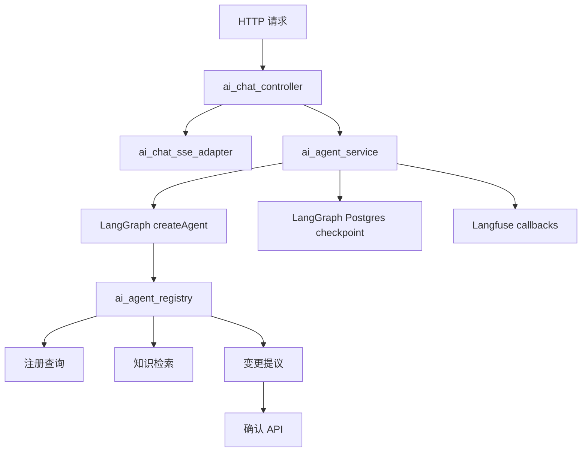

# AI 助手架构

本文档描述当前 AI 助手的实现边界、数据流和维护入口。产品能力说明见 [AI 助手能力](ai-assistant-capabilities.md)。

## 运行时分层



- `ai_chat_controller.ts` 只负责会话归属、输入校验、消息持久化和 HTTP/SSE 生命周期。
- `ai_chat_sse_adapter.ts` 负责 SSE 写出、keepalive、工具状态详情、阶段和确认事件。
- `ai_agent_service.ts` 创建 LangChain Agent，配置 LangGraph checkpoint、上下文压缩、模型调用限制和 Langfuse。
- `ai_agent_registry.ts` 是纯适配层，只向 Agent 注册工具，不承载 HTTP 或数据库编排。

## 工具边界

| 工具                               | 行为                                                                                                                                              |
| ---------------------------------- | ------------------------------------------------------------------------------------------------------------------------------------------------- |
| `diagnose_my_access`               | 只诊断当前认证用户的服务端权限。                                                                                                                  |
| `run_registered_query`             | 只调用 `ai_agent_query_registry` 中的固定模板；禁止自由 SQL。所有列表固定最多返回 20 条，不提供分页或继续查询协议，更多数据需到对应管理模块查看。 |
| `search_knowledge`                 | 只检索已授权的知识文档，用于产品说明和流程指导，不用于实时系统数据。                                                                              |
| `propose_system_management_change` | 只创建非 API Key 的持久化变更提议（如用户、角色、权限、创建 API Key），不执行破坏性操作。执行必须经过确认 API。                                   |
| `propose_api_key_revocation`       | 只创建吊销活跃 API Key 的持久化提议，与删除工具解耦；不执行。执行必须经过确认 API。                                                               |
| `propose_api_key_deletion`         | 只创建删除已吊销 API Key 的持久化提议；不执行。执行必须经过确认 API。                                                                             |

查询模板具有稳定 code/version、参数 schema、权限码、服务端作用域、字段脱敏和固定 20 条结果上限。缺少必要参数时，`AiAgentPendingQuery` 只保存参数收集状态，下一轮会话重新校验模板、归属、权限和有效期。

变更提议由 `prepare` 创建安全目标摘要和 payload；`confirmAiAgentAction` 在执行前重新校验会话归属、权限、proposal 状态、有效期和目标当前状态，并记录审计。

## 状态与持久化

- `AiChatConversation`、`AiChatMessage`：保存完整用户可见历史和引用，作为前端历史 API 的稳定数据源。
- LangGraph checkpoint：保存 Agent 跨请求运行状态、压缩后的上下文、rolling summary 和最近一次已提交的工具调用状态，thread key 为 `ai-chat:{userId}:{conversationId}`。checkpoint 存在时，后续请求只提交最新用户消息；缺失时才从消息表恢复完整历史。
- Agent 图通过 `ai_agent_run_state` middleware 节点记录 `model_running`、`tool_pending`、`running` 和 `completed` 运行阶段；`ai_agent_summary_boundary` 节点在摘要成功后记录 `aiSummaryCoveredThroughMessageId`。这些状态随 checkpoint 保存，中断时保留最近阶段供下一轮恢复判断。
- `AiAgentPendingQuery`：保存多轮查询的缺参状态，不保存原始查询结果。
- `AiAgentConfirmation`：保存待确认提议及安全摘要，不向普通消息暴露 payload 或密钥。
- `ai_conversation_state.ts`：统一清理 checkpoint 和 pending query；重新生成和会话删除通过此入口处理，不可恢复失败也使用该入口。

客户端断开、用户停止生成或请求超时属于可恢复中断：系统保留最近一次已提交的 checkpoint，下一轮同一会话继续使用它。不可恢复错误、重新生成和会话删除会清理 checkpoint。受控管理操作仍必须经过结构化确认；确认执行使用数据库条件更新和执行令牌保证幂等，Agent 恢复不会绕过确认流程。

AI 请求完成时间不再由自研 `AiChatTiming` 记录，统一依赖 Langfuse（可选）和现有审计日志。Langfuse 未配置时不发起外部观测请求。

## SSE 与前端

后端 SSE 事件包括 `user`、`agent_status`、`agent_confirmation`、`agent_citations`、`delta`、`done` 和 `error`。`agent_status` 只返回工具名称、状态、阶段及安全详情，不返回敏感参数或原始结果。

前端 `ai-chat-api.ts` 解析事件，`useAiChat.ts` 管理流式消息和确认状态，`AiChatAssistant.vue` 提供会话、工具状态、确认、重试、停止生成和快捷建议。AI 查询没有“继续查看”按钮；完整数据由业务模块自身的列表分页提供。

## 验证

修改 Agent、工具协议、提示词或确认流程后运行：

```bash
pnpm --dir apps/backend typecheck
pnpm --dir apps/backend lint:check
pnpm --dir apps/backend exec node ace test --files=tests/functional/ai_agent_query_registry.spec.ts --files=tests/functional/ai_agent_confirmation.spec.ts
pnpm --dir apps/backend exec node ace ai:evaluate
pnpm --dir apps/frontend typecheck
pnpm --dir apps/frontend lint:check
```
