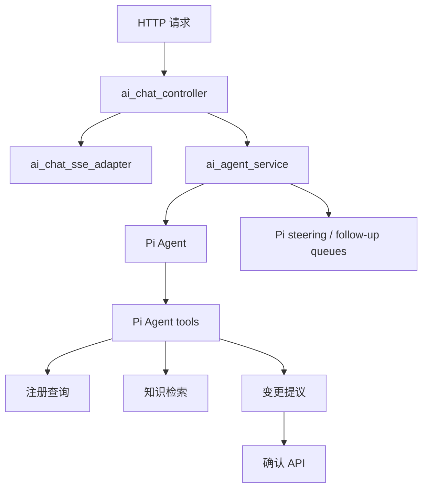

# AI 助手架构

本文档描述当前 AI 助手的实现边界、数据流和维护入口。产品能力说明见 [AI 助手能力](ai-assistant-capabilities.md)。

## 运行时分层



- `app/ai` 集中维护 Pi runtime、会话编排、SSE 适配、提示词策略和工具注册；可复用的领域逻辑仍位于 `app/services`。
- `ai_chat_controller.ts` 只负责会话归属、输入校验、消息持久化和 HTTP/SSE 生命周期。
- `ai_chat_sse_adapter.ts` 只负责把单一 Pi `AgentEvent` 流转换为 SSE、keepalive、工具状态详情、阶段和确认事件。
- `ai_agent_service.ts` 创建 Pi Agent，配置模型、上下文和工具事件流；每个会话使用稳定的 Pi `sessionId`，并显式使用 Pi 的 steer/follow-up 单条队列策略。
- `ai_agent_pi_stream.ts` 负责创建 Pi Agent、订阅原始事件并暴露控制句柄；消息流和工具流统一通过 Pi 事件处理。
- `ai_agent_tool_registry.ts` 直接返回 Pi `AgentTool[]`；工具 schema、执行逻辑和业务服务调用在同一注册边界内维护。
- Pi 生命周期钩子在工具调用前校验输入，在调用后识别错误和终止结果；确认提议及终止性业务错误使用原生 `terminate` 结束本轮。
- Pi 的 `prepareCompaction`/`compact` 按 token 预算压缩长上下文，摘要写入 `AiChatConversation.contextSummary`，完整消息历史不变；`shouldStopAfterTurn` 防止终态工具结果触发无意义的下一轮推理。
- Pi 的 `prepareNextTurnWithContext` 在每轮模型调用前刷新待确认提议和 pending query 上下文；`tool_execution_update` 仅转发白名单进度字段到 `agent_status` SSE 事件。
- 只读诊断、注册查询和知识检索工具允许并行执行；变更提议保持顺序执行，避免并行产生多个需要确认的状态。

## 工具边界

| 工具                               | 行为                                                                                                                                              |
| ---------------------------------- | ------------------------------------------------------------------------------------------------------------------------------------------------- |
| `diagnose_my_access`               | 只诊断当前认证用户的服务端权限。                                                                                                                  |
| `run_registered_query`             | 只调用 `ai_agent_query_registry` 中的固定模板；禁止自由 SQL。所有列表固定最多返回 20 条，不提供分页或继续查询协议，更多数据需到对应管理模块查看。 |
| `search_knowledge`                 | 只检索已授权的知识文档，用于产品说明和流程指导，不用于实时系统数据。                                                                              |
| `propose_system_management_change` | 只创建非 API Key 的持久化变更提议（如用户、角色、权限），不执行破坏性操作。执行必须经过确认 API。                                                 |
| `propose_api_key_creation`         | 只创建 API Key 的持久化变更提议；不执行，必须经过确认 API。                                                                                       |
| `propose_api_key_revocation`       | 只创建吊销活跃 API Key 的持久化提议，与删除工具解耦；不执行。执行必须经过确认 API。                                                               |
| `propose_api_key_deletion`         | 只创建删除已吊销 API Key 的持久化提议；不执行。执行必须经过确认 API。                                                                             |

查询模板具有稳定 code/version、参数 schema、权限码、服务端作用域、字段脱敏和固定 20 条结果上限。缺少必要参数时，`AiAgentPendingQuery` 只保存参数收集状态，下一轮会话重新校验模板、归属、权限和有效期。

变更提议由 `prepare` 创建安全目标摘要和 payload；`confirmAiAgentAction` 在执行前重新校验会话归属、权限、proposal 状态、有效期和目标当前状态，并记录审计。

## 状态与持久化

- `AiChatConversation`、`AiChatMessage`：保存完整用户可见历史、引用和脱敏后的 `runtime_details`，作为前端历史 API 的稳定数据源；历史会话可恢复运行详情，但不会恢复原始工具参数或敏感结果。
- 每次新请求根据 `AiChatMessage` 构造初始上下文；运行中的人工介入使用当前 Pi Agent 的 `steer` 或 `followUp` 队列，不重新构造 Agent。
- 恢复历史时由 Pi 的 compaction 与 `transformContext` 按模型 `contextWindow` 和输出预算进行 token 级上下文处理，`convertToLlm` 负责模型消息过滤；数据库仍保存完整历史，滚动摘要存储在会话上并在下一次请求注入动态上下文。
- `AiAgentPendingQuery`：保存多轮查询的缺参状态，不保存原始查询结果。
- `AiAgentConfirmation`：保存待确认提议及安全摘要，不向普通消息暴露 payload 或密钥。
- `ai_conversation_state.ts`：统一清理 pending query；重新生成和会话删除通过此入口处理。

客户端断开、用户停止生成或请求超时会调用 Pi Agent 的 `abort`；系统保留已持久化消息，下一次用户消息会创建新的 Agent 运行。运行中的人工输入使用 `steer` 或 `followUp`，受控管理操作仍必须经过结构化确认。

AI 请求完成时间由现有审计日志和运行状态记录，不依赖外部观测服务。

## SSE 与前端

后端 SSE 事件包括 `user`、`agent_status`、`agent_confirmation`、`agent_citations`、`delta`、`done` 和 `error`。`agent_status` 只返回工具名称、状态、阶段及安全详情，不返回敏感参数或原始结果。

前端 `ai-chat-api.ts` 解析事件，`useAiChat.ts` 管理流式消息和确认状态，`AiChatAssistant.vue` 提供会话、工具状态、确认、重试、停止生成和快捷建议。AI 查询没有“继续查看”按钮；完整数据由业务模块自身的列表分页提供。

## 验证

修改 Agent、工具协议、提示词或确认流程后运行：

```bash
pnpm --dir apps/backend typecheck
pnpm --dir apps/backend lint:check
pnpm --dir apps/backend exec node ace test --files=tests/functional/ai_agent_query_registry.spec.ts --files=tests/functional/ai_agent_confirmation.spec.ts
pnpm --dir apps/backend exec node ace ai:evaluate
pnpm --dir apps/frontend typecheck
pnpm --dir apps/frontend lint:check
```
