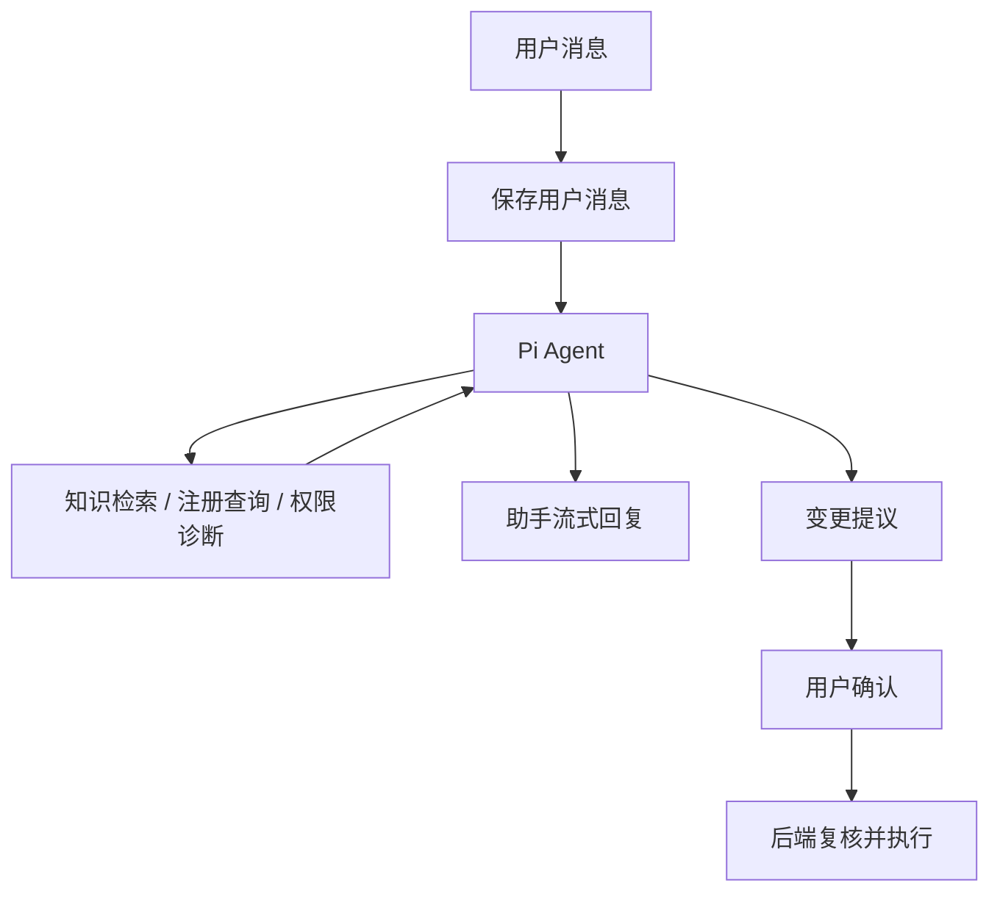

# AI 助手能力

AI 助手是受后端治理、以工具为驱动的管理控制台助手。它根据项目知识、系统查询和权限诊断回答问题，并准备需要确认的管理变更；不会绕过权限、数据库和确认流程。

## 入口能力横向对比

当前有四个 AI 入口：管理台默认 AI 助手、企业微信机器人、钉钉机器人和飞书机器人。四者不是四套不同的 AI：外部机器人通过统一的 `AiChannelBridge` 接入，与管理台复用同一套 Agent、知识库、注册查询、受控操作、用户绑定和权限校验。因此，完成外部身份绑定后，四个入口的业务能力原则上保持一致；下表中的差异主要是渠道呈现和运行条件差异。

| 对比维度         | 默认 AI 助手（管理台）                             | 企业微信机器人                                      | 钉钉机器人                                             | 飞书机器人                                                                                |
| ---------------- | -------------------------------------------------- | --------------------------------------------------- | ------------------------------------------------------ | ----------------------------------------------------------------------------------------- |
| 使用位置         | 登录后的管理台 AI 工作台                           | 企业微信智能机器人                                  | 钉钉企业内部应用机器人                                 | 飞书企业自建应用机器人                                                                    |
| 身份与权限       | 直接使用当前登录用户                               | 首次发消息获取绑定码，绑定后复用系统用户角色和权限  | 同左                                                   | 同左                                                                                      |
| 知识库问答       | 支持，显示完整助手回复和工具状态                   | 支持，回复通过企微消息发送                          | 支持，回复通过钉钉消息发送                             | 支持，回复通过飞书消息或卡片发送                                                          |
| 权限诊断         | 支持 `diagnose_my_access`                          | 支持                                                | 支持                                                   | 支持                                                                                      |
| 实时系统查询     | 支持注册查询模板，结果最多 20 条                   | 支持，同一上限                                      | 支持，同一上限                                         | 支持，同一上限                                                                            |
| 管理变更         | 支持创建 API Key、用户/角色/权限管理等受控操作提案 | 支持，确认卡片确认后执行                            | 支持，互动卡片确认后执行                               | 支持，Interactive Card 确认后执行                                                         |
| 普通问答流式体验 | 原生 SSE 增量渲染，可停止、重试并查看工具状态      | 原生企微流式回复                                    | 配置流式回复互动卡片模板后支持；未配置时降级为普通文本 | 不使用 WebSocket 文本流；通过发送并更新 Interactive Card 模拟流式，复杂 Markdown 可能降级 |
| 管理操作确认     | 管理台确认条/确认卡片                              | 企微模板卡片                                        | 钉钉互动卡片模板，需预先发布模板                       | 飞书 Interactive Card                                                                     |
| 对话控制         | 完整历史、创建新会话、继续处理待确认状态           | 支持 `/new` 新建当前渠道会话                        | 支持 `/new` 新建当前渠道会话                           | 支持 `/new` 新建当前渠道会话                                                              |
| 输入形态         | 文本、管理台控件                                   | 文本和企微语音事件                                  | 当前适配文本消息                                       | 当前适配文本消息                                                                          |
| 最适合的场景     | 需要查看上下文、处理较多数据或执行连续管理任务     | 移动端快速问答、语音输入和企微内协作                | 需要钉钉互动卡片和群聊协作                             | 需要飞书卡片化回复和飞书群聊协作                                                          |
| 额外前置条件     | 已登录且拥有对应权限                               | Bot ID、Secret、Tenant ID、WebSocket 配置和身份绑定 | Client ID、Secret，以及按需配置的确认/流式卡片模板     | App ID、Secret、长连接事件订阅、发布版本和消息权限                                        |

### 如何理解这张表

- “支持”表示该入口可以调用同一套后端能力，不表示可以绕过权限。每次查询都会重新校验权限、参数、作用域和结果上限；每次管理变更都必须经过结构化确认。
- 外部机器人不会把自己的平台身份直接当作系统权限。只有完成 `channel + externalTenantId + externalUserId → system user` 绑定后，才可以访问系统能力。
- 企微、钉钉和飞书的差异不应在业务 service 中分别实现。新增 AI 能力时，应先注册到共享的工具、查询或动作 registry，再由各渠道适配器负责消息和卡片转换。
- 外部渠道更适合快速问答和确认操作；需要完整历史、较长结果、工具过程或连续管理任务时，优先使用管理台默认 AI 助手。查询达到 20 条后，四个入口都应引导用户打开对应管理模块查看完整分页数据。

## 支持范围

| 能力                 | 支持方式                                                                 | 限制                                                                                                                         |
| -------------------- | ------------------------------------------------------------------------ | ---------------------------------------------------------------------------------------------------------------------------- |
| 项目、产品与流程问答 | `search_knowledge` 检索已索引文档                                        | 涉及项目事实时必须先检索；只使用授权文档，文档摘录不是授权依据。                                                             |
| 权限诊断             | `diagnose_my_access`                                                     | 只针对当前登录用户。                                                                                                         |
| 实时系统查询         | `run_registered_query`                                                   | 只使用注册模板；固定最多 20 条；不支持自由 SQL、任意字段、分页或继续查询。更多数据请前往 API Key、用户、访问控制或审计模块。 |
| 管理变更             | 专用 Pi `AgentTool` + 确认 API；API Key 创建、吊销、删除分别使用专用工具 | AI 只能生成提案，不能直接执行；确认时再次校验权限和目标状态。不同 API Key 操作彼此独立，避免模型混淆。                       |
| 多轮对话             | Pi Agent、完整消息历史、持久化滚动摘要和 pending query                   | compaction 仅影响模型请求，不截断持久化历史；终态工具结果安全停止，长任务可发送工具进度。                                    |

## 请求流程



查询结果达到 20 条后，助手不会继续请求下一批；应引导用户打开对应管理模块查看完整数据。业务模块自己的表格分页与 AI 助手查询协议相互独立。

## 安全边界

- 后端是认证、授权、参数校验、脱敏和审计的唯一权威。
- 模型永远不能生成或执行自由 SQL。
- 查询每次调用都重新校验模板、权限和参数，结果固定上限 20 条。
- 破坏性操作必须通过结构化确认卡，模型文本不是授权通道。
- API Key、密码、token 和密钥值不会进入普通查询结果、聊天历史或日志。

## 配置与观测

模型、Embedding、ASR 和请求超时通过系统管理中的「LLM 配置」页面维护，保存后对下一次请求生效。Web AI 助手支持语音输入：录音最长 60 秒、音频最大 10 MB，停止后先由配置的 `Qwen3-ASR-0.6B-4bit`（或自定义模型）转写，再将中文文本交给对话模型。上下文预算由模型的 `contextWindow`、输出上限和 Pi 的 token 估算共同控制；长会话由 Pi compaction 生成滚动摘要。

AI 请求运行状态由 Pi Agent、现有审计日志和对话消息记录维护。

评估命令：

```bash
pnpm --dir apps/backend exec node ace ai:evaluate
```

实现细节见 [AI 助手架构](ai-assistant-architecture.md)，安全边界见 [安全与治理](security.md)。
