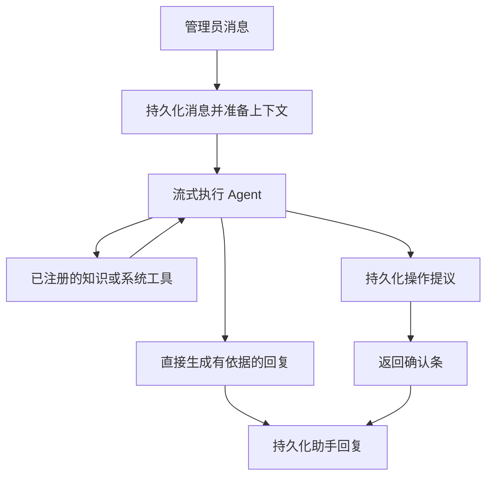
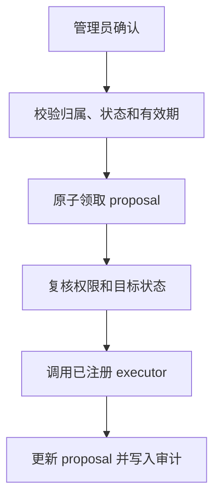

# AI 助手能力

AI 助手用于受治理的管理工作。它提供流式、多轮对话，但业务事实、授权和执行决策始终由后端控制。

## 能做什么

| 能力           | 用户价值                                                                       | 保护措施                                                            |
| -------------- | ------------------------------------------------------------------------------ | ------------------------------------------------------------------- |
| 产品与流程问答 | 基于已批准的知识文档回答问题                                                   | 检索遵守文档与角色权限，来源随回复保存                              |
| 当前系统信息   | 说明当前账号权限，以及 API Key、用户、角色、权限和审计活动中的已批准非敏感信息 | 每次工具调用都在后端重新鉴权，不返回凭据或密钥                      |
| 受控数据查询   | 查询已注册的管理模板，并跨轮收集缺失的安全参数                                 | 不支持自由 SQL、任意表、字段或过滤器；结果限量、脱敏并审计          |
| 受控管理操作   | 提议 API Key、用户、角色和权限变更                                             | proposal 会过期，必须经 UI 确认；执行时重新校验归属、权限和目标状态 |
| 会话连续性     | 流式回复、历史保存、重新生成和长上下文压缩                                     | 完整消息历史始终保留，仅压缩发送给模型的请求                        |

## 请求处理流程



提议创建后并不会执行。确认走独立流程：



## 知识库与检索

只有通过知识文档页面上传、经审查的 UTF-8 文本文档会被索引。服务分开保存文档和分块，检索时执行角色过滤，并以语义 embedding 和词法加权排序。用户记录、审计日志、会话和凭据绝不会自动进入知识库。

embedding 模型必须匹配向量维度（默认 `1024`）。上传、替换和重建索引会产生 embedding 请求；普通聊天、系统查询和受控操作不会产生 embedding，除非助手显式调用知识检索。

## 配置与评估

助手通过 `AI_OPENAI_*` 接入 Ollama、OpenAI、DeepSeek、Qwen 或其他 OpenAI 兼容服务；知识检索使用 `AI_EMBEDDING_*`。超时、重试和上下文压缩配置位于 `apps/backend/.env.example`。

使用以下命令评估已配置模型：

```bash
pnpm --dir apps/backend exec node ace ai:evaluate
```

该命令使用 mock 工具，不连接业务数据库，不创建 proposal，也不执行 mutation。它覆盖知识检索、系统事实、权限拒绝、受控变更、缺参续聊和自由 SQL 拒绝。

实现与维护细节见 [AI 助手架构](ai-assistant-architecture.md)，安全审查见[安全与治理](security.md)。
